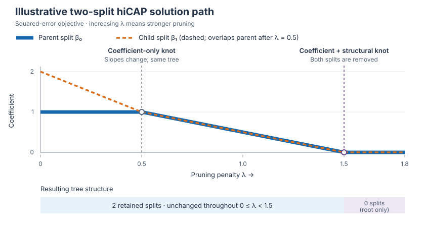

# Sparse pruning and hierarchical shrinkage

Prune a CART tree with the [CAP/hiCAP penalty](https://arxiv.org/abs/0909.0411),
optionally followed by hierarchical shrinkage (HS). `sp_alpha` controls pruning
strength; `reg_param` controls shrinkage without changing the retained structure.
The penalty groups each split with all its descendant splits.

[Fit a model](#fit-a-model) · [Tune strengths](#tune-regularization-strengths) ·
[Solution paths](#solution-paths) · [Choose a solver](#solver-reference) ·
[Implementation and references](#implementation-and-references)

## Fit a model

### Regression

| Task | Supply strengths yourself | Select strengths by CV |
| --- | --- | --- |
| Pruning only | `SPTreeRegressor` | `SPTreeRegressorCV` |
| Pruning + HS | `SHSTreeRegressor` | `SHSTreeRegressorCV` |

All classes import directly from `imodels`. Non-CV models take `sp_alpha` and,
for HS, `reg_param`. CV models select those strengths and expose `sp_alpha_`
and `reg_param_` after fitting.

```python
from sklearn.datasets import load_diabetes
from imodels import SPTreeRegressorCV, SHSTreeRegressorCV

X, y = load_diabetes(return_X_y=True)
pruned = SPTreeRegressorCV(cv=5, max_leaf_nodes=32, random_state=0).fit(X, y)
shrunk = SHSTreeRegressorCV(cv=5, max_leaf_nodes=32, random_state=0).fit(X, y)
predictions = shrunk.predict(X)
selected_strengths = shrunk.sp_alpha_, shrunk.reg_param_
```

Defaults are `ord=np.inf, solver="auto"`. For eligible regression trees this
computes the fast structural path: all distinct pruned trees, without solving
for every coefficient. Predictions use retained CART node values, optionally
shrunk by HS—not the penalized coefficients used to decide pruning.

### Binary classification

Use `SPTreeClassifier` / `SPTreeClassifierCV` for pruning, or
`SHSTreeClassifier` / `SHSTreeClassifierCV` to add HS. All provide `predict`
and `predict_proba`. Classification uses APA-APG2 with logistic loss and
numeric-grid CV, not the exact squared-error paths below.
HS strengths must be numeric; GCV and multiclass classification are unsupported.

## Tune regularization strengths

### Cross-validation

All four SP/SHS CV classes accept integer `cv` (default: 3): shuffled KFold for
regression, shuffled StratifiedKFold for classification. Each training fold
grows its own tree, prunes candidates, applies HS if requested, and scores
predictions on held-out rows. The selected configuration is refitted on all data.

- `sp_alpha_list="auto"` evaluates distinct structural states for eligible
  regression trees. Candidates come from training-fold knots, never a full-data
  tree. Other cases, including classification and explicit APA, use a numeric grid.
- A numeric `sp_alpha_list` requests grid CV.
- SHS defaults to a numeric `reg_param_list`, selecting HS by held-out scores;
  SP disables HS by default. `reg_param_list="gcv"` changes only HS selection
  as described below.
- `selection_rule="one_se"` favors the simplest tree within one standard error
  of the best mean score; `"best"` selects the highest mean score.
  `scoring` defaults to negative mean squared error for regression and accuracy
  for classification.

Inspect `cv_params_` and `cv_scores_` for candidates and fold scores, and
`cv_path_mode_` for `"structural"` versus `"grid"`. The final fit uses the
selected absolute penalty, not the nearest full-data knot. Structural CV reuses
scores for identical retained states; custom scorers must depend on predictions
or structure, not the numerical penalty label.

Non-CV classes do not run folds internally. For custom splitters, including
grouped or time-ordered data, use sklearn's `GridSearchCV` around a non-CV
estimator with `prefit=False`, rather than a wrapper with internal shuffled folds.

### Automatic HS with GCV

GCV selects HS from a fitted tree's node statistics. It is optional and does
**not** replace held-out pruning selection in a CV model:

```python
auto_hs = SHSTreeRegressorCV(
    cv=5, reg_param_list="gcv", max_leaf_nodes=32, random_state=0,
).fit(X, y)
```

Here GCV selects HS for each training fold's pruned tree; held-out fold scores
still select `sp_alpha`. HS is reselected after full-data pruning.
Without outer CV, `SHSTreeRegressor(sp_alpha=..., reg_param="gcv")` selects HS
after fixed-penalty pruning. For HS alone, use `HSTreeRegressor(reg_param="gcv")`
or `HSTreeRegressorCV` with numeric strengths for k-fold selection.

GCV requires node-based HS, a single-output tree with `squared_error` or
`friedman_mse`, uniform positive weights, and no active monotonic constraints.
Unsupported configurations, including forests, need numeric strengths or CV.
`reg_param_` stores the selected strength; `gcv_results_` stores scores,
effective degrees of freedom, and diagnostics. An infinite strength means
root-mean predictions. Sparse-HS wrappers accept `reg_param=None` as a GCV
compatibility alias; ordinary HS requires the explicit `"gcv"` value.

### K-fold CV versus GCV

- **K-fold:** evaluates the grow/prune/shrink pipeline on held-out rows and
  supports your prediction metric. It costs fold fits and candidate evaluation;
  each fold trains on less data, and selected strengths can vary with the split.
- **GCV:** usually cheaper for HS selection, without HS-specific fold refits or
  held-out predictions. Its training-error correction accounts for a fixed
  tree's effective degrees of freedom, but not for learning/pruning that tree
  from the same targets. It can therefore be optimistic; it is not exact
  leave-one-out refitting. Using it inside SHS CV still incurs pruning-fold costs.

Use k-fold when held-out selection justifies the computation; GCV is a fast
approximation for eligible trees. Neither guarantees better strengths.
Evaluate the selected model on an untouched test set or an additional outer CV
loop, not its winning tuning score. See sklearn's
[cross-validation guide](https://scikit-learn.org/stable/modules/cross_validation.html).

## Solution paths

A pruning path varies `sp_alpha` (λ) on **one fixed fitted tree**, not `reg_param`.
For squared-error regression with `ord=np.inf`, there are two useful outputs:

- **Structural path:** penalties where the retained tree changes. This is enough
  to traverse pruned trees and select pruning by CV; it is the regression default.
- **Coefficient path:** every penalty where a penalized coefficient changes
  **slope**. Between consecutive knots the coefficients are linear in λ, so the
  full path supports exact interpolation. A coefficient knot need not change
  the tree; interpolating only at structural knots can miss a bend.



This analytic example minimizes
`0.5 * ||beta - [1, 2]||² + λ * (max(|beta₀|, |beta₁|) + |beta₁|)`.
At λ = 0.5 the two coefficients meet and change slopes, without changing the
tree. At λ = 1.5 both vanish, removing both splits. More generally, a split is
retained while its descendant group is active—even if its own coefficient is zero.

### Traverse and preview pruned trees

With the structural solver, fitted wrappers expose `pruning_path_`;
`coef_` and `coefficient_path_` are `None`. To plot states, keep the original
CART tree and use the fitted-tree helpers directly:

```python
from sklearn.tree import DecisionTreeRegressor, plot_tree
from imodels.tree.sparse_pruning import (
    fitted_tree_linf_exact_topology_path, materialize_fitted_tree_topology,
)

source = DecisionTreeRegressor(max_leaf_nodes=8, random_state=0).fit(X, y)
structure = fitted_tree_linf_exact_topology_path(source)
for alpha, removed_node_ids in structure.iter_node_pruning_events():
    print(alpha, removed_node_ids)  # increasing penalty; remove each tied batch

alpha = float(structure.lambdas[len(structure.lambdas) // 2])
preview = materialize_fitted_tree_topology(source, structure, alpha)
plot_tree(preview)
```

At a structural knot, the disappearing splits are already removed;
`below=True` previews the state immediately below that knot. Previews leave
`source` unchanged and show original CART values, without HS. They preserve
original node IDs without compacting backing arrays: use
`len(structure.tree_nodes_at(alpha))` for the retained split count, not preview
array sizes. Stream previews rather than storing a copy at every knot.

### Access the full coefficient path

```python
from imodels import SPTreeRegressor

model = SPTreeRegressor(
    sp_alpha=1.0, solver="coefficient_path", max_leaf_nodes=32, random_state=0,
).fit(X, y)
predictions = model.predict(X)      # tree at the supplied sp_alpha=1.0
beta = model.coef_                  # coefficients at that same penalty
path = model.coefficient_path_      # also available with solver="hicap"
beta_elsewhere, intercept = path.at(0.5 * path.lambdas[0])
```

`path.lambdas` and `path.coefficients` store knots, endpoints, and their coefficient
vectors. `path.at(alpha)` interpolates within that range and returns a separate
array plus intercept. It does **not** change `model.coef_`, the fitted tree,
or `predict()`. Fit another model with a different `sp_alpha` to change the
prediction tree; setting the parameter alone does not re-prune.

CV models expose the same attributes at their selected `sp_alpha_`. Eligible
automatic CV still scores structural states when the final-fit solver is
`"coefficient_path"` or `"hicap"`; only the final fit needs the full path.

Coefficients refer to unnormalized local stumps of the original, unpruned tree,
before HS. `coef_node_ids_` identifies those original splits, not the renumbered
nodes of the compacted model. Keep the original tree if reconstructing its
feature matrix. Classification/APA grid paths do not provide this exact
piecewise-linear interpolation contract.

## Solver reference

| `solver` | What it computes | Use when |
| --- | --- | --- |
| `"auto"` | Structural path when eligible; otherwise proximal for infinity-norm regression, APA for other supported objectives | Default for fitting and CV |
| `"topology"` | Exact structural knots; no coefficients | You only need pruned trees |
| `"proximal"` | Certified coefficients at one penalty | You need coefficients, but not their full path |
| `"coefficient_path"` | Complete certified diagonal-tree coefficient path | You need all coefficient knots and interpolation |
| `"hicap"` | Generic, slower, certified coefficient path | Small reference/validation problems |
| `"apa_apg2"` | Approximate point solution | Binary classification or `ord=2` |

Tree-specific paths require `ord=np.inf`, zero/default `support_tol`, and an
unconstrained single-output mean-based regression tree on its fitting rows and
weights. Wrappers do not assume this for external `prefit=True` trees or forest
OOB data. Explicitly incompatible choices or failed certificates raise errors.

For `p` splits, the structural path takes `O(p log p)` time and `O(p)` space
after fitting. CV and previews still pay for copies and held-out predictions.
Full coefficient paths additionally store dense coefficient rows and rebuild
active constraints; they are optional because pruning does not need that work.

"Exact" means within floating-point certificate tolerances, not symbolic
arithmetic. `tol` controls those tolerances; for APA it only controls stopping.
`max_iter` caps point iterations or coefficient-path events, depending on the
solver. For compatibility, wrapper `sp_alpha=0` preserves every original split;
strict mathematical path queries omit zero-activation splits even at zero.
See the [optimization guide](optimization/README.md) for numerical contracts.

## Implementation and references

### Algorithms

- **Penalty and hiCAP:** [Zhao, Rocha, and Yu (2009)](https://arxiv.org/abs/0909.0411),
  Section 3.1.2. Our `hicap` follows active linear constraints of the infinity-norm
  formulation; it is independently implemented, not a MATLAB translation.
- **APA-APG2:** accelerated gradient steps plus averaged group-proximal updates
  with decreasing approximation, following Algorithm 2 of
  [Shen et al. (2017)](https://ojs.aaai.org/index.php/AAAI/article/view/10873).
  The precursor is [Yu (2013)](https://papers.nips.cc/paper_files/paper/2013/hash/49182f81e6a13cf5eaa496d51fea6406-Abstract.html).
  Warm starts sample a grid; they do not enumerate exact knots.
- **Proximal:** child-to-parent group updates from
  [Jenatton et al. (2011), Section 3.4](https://jmlr.org/papers/v12/jenatton11a.html),
  inside [FISTA (Beck and Teboulle, 2009)](https://doi.org/10.1137/080716542)
  for general designs. The diagonal-tree specialization uses weighted projections
  to solve each penalty in one sweep.
- **Structural path:** a tree-specific reduction to weighted isotonic pooling.
  Heap-based tree pooling: [Pardalos and Xue (1999)](https://doi.org/10.1007/PL00009258).
  See our [CAP-to-activation derivation](optimization/README.md#why-the-fitted-tree-gram-matrix-is-diagonal).
- **Coefficient path:** our diagonal-tree continuation combines structural bounds,
  exact point solves, and intervals with unchanged active constraints;
  see the [derivation](optimization/README.md#full-coefficient-path-for-a-fitted-tree).
- **HS and GCV:** [Agarwal et al. (2022)](https://arxiv.org/abs/2202.00858) for HS;
  [Golub, Heath, and Wahba (1979)](https://doi.org/10.1080/00401706.1979.10489751)
  for GCV, applied here conditional on the retained tree.

### Code layout

```text
sparse_pruning/
  sparse_hierarchical_shrinkage.py   estimator fitting, pruning, and HS
  _solver.py                       solver validation and dispatch
  _cv.py                           fold-local structural CV
  fitted_tree.py                   sklearn statistics and preview adapters
  optimization/                    mathematical solvers and path results
  optimizations.py                 legacy point imports and GCV/subset helpers
```

Shared HS/GCV mathematics lives in `imodels/tree/_hs_gcv.py`.
`tests/sparse_pruning_test.py` is the compact standalone suite;
`tests/sparse_pruning/` holds extended numerical tests, and
`tests/hs_gcv_test.py` covers shared HS/GCV behavior.
